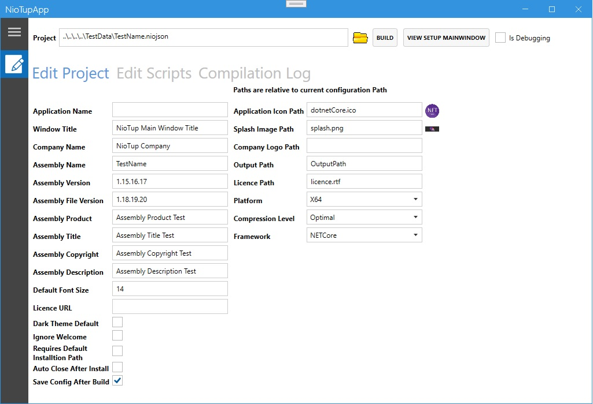

# NioTup
.NET Core WPF Setup Creator - Under development

## About
WPF .NET Core 5.0 - Creates an Installer for Windows Applications from a json config file.

- Light and Dark themes
- Setup already Zips files and Extracts them on a specified location
- Downloads Files/Images/etc to a specified location
- Allow C# scripts, handling Setup events and more.
- Multi Language Suport

## ToDo

- Color change, button customizations all on XAML
- Insert keys on the Windows registry
- Setup Unninstaller


# :rocket: Technologies

The following tools were used in this project:

- [Windows Presentation Foundation - WPF](https://docs.microsoft.com/en-us/visualstudio/designers/getting-started-with-wpf?view=vs-2019)
- [.NET Core 5.0](https://dotnet.microsoft.com/download/dotnet/5.0)
- [MahApps](https://mahapps.com)

## Requirements

- [Visual Studio](https://visualstudio.microsoft.com)
- [.NET Core 5.0](https://dotnet.microsoft.com/download/dotnet/5.0)

# :computer: How to run

```bash
# Clone this project
$ git clone https://github.com/nilbersilva/NioTup

# Access folder
$ cd NioTup

# Build
$ dotnet build

# Access folder of application builder
$ cd NioTup

# Run the project
$ dotnet run
```

## Screenshots

<div> 
  
  
  
  
</div>

# :page_facing_up: License


This project is under license from MIT.

<a href="#top">Back to top</a>
